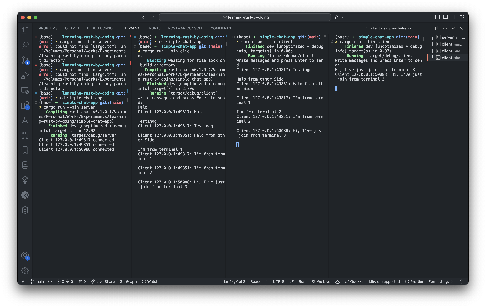

# Simple Chat App

- This is a simple chat app that allows users to send messages to each other in real-time.
- Once a user sends a message, it is broadcasted to all other users in the chat room.
- Only 1 Room is available for all users to chat in.



## How to run the app

Run server

```bash
cargo run --bin server
```

Run client

```bash
cargo run --bin client
```